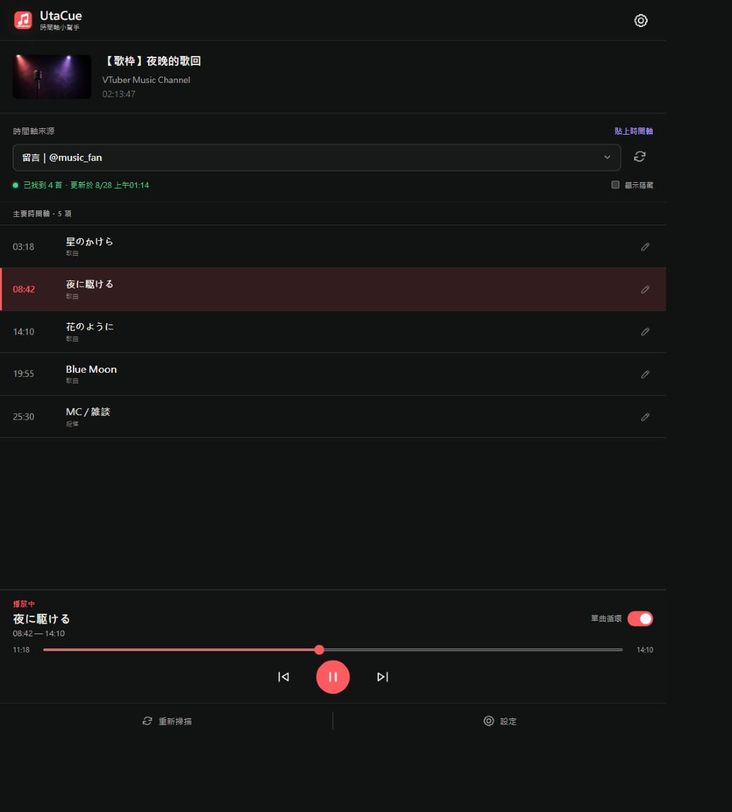
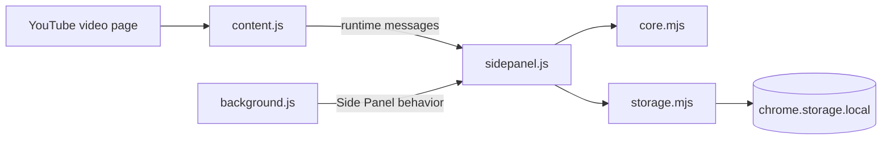

# UtaCue

UtaCue is a Chrome Manifest V3 Side Panel extension that turns timestamp lists from YouTube videos into browsable, editable, seekable, and single-song-loopable setlists.

It does not require the YouTube API, a backend, or a login. Timeline sources can come from the current video's description, comments already loaded on the page, or text pasted by the user.

## Screenshot



## Features

- Scan the current YouTube video's description and comments already loaded in the page.
- Parse `m:ss`, `mm:ss`, and `h:mm:ss` timestamps; invalid timestamps are ignored.
- Split timestamps into secondary timelines when time moves backwards, with controls to switch sources or promote a secondary block.
- Click an entry to seek and play it; songs can loop until the next song/chapter or the end of the video.
- Classify entries as `song`, `chapter`, `note`, or `hidden`, and edit their titles, start times, and custom end times.
- Show added, changed, and removed counts during a rescan while preserving existing manual edits.
- Store each setlist in `chrome.storage.local`, keyed by the YouTube `videoId`.
- Export the current video's or all setlists as JSON, and import JSON backups.

## Tech Stack

- Chrome Extension Manifest V3
- Chrome Side Panel, content script, and service worker
- Native JavaScript ES modules and browser APIs
- Node.js built-in `node:test` test runner
- No third-party npm runtime dependencies

## Requirements

- Chrome 114 or later, as specified by `minimum_chrome_version` in `manifest.json`.
- A Node.js environment with support for `node:test` to run the tests. The repository does not declare an exact minimum Node.js version.

## Installation

This is an unpacked Chrome extension and has no npm installation step:

1. Open `chrome://extensions`.
2. Enable **Developer mode**.
3. Click **Load unpacked** and select this project directory.
4. Open a YouTube video and click the UtaCue toolbar icon to open the Side Panel.

If the extension was loaded after the YouTube tab was already open, reload the YouTube video page so that `content.js` can be injected.

## Usage

1. Open UtaCue on a YouTube video page.
2. Click **Scan current page** to read the description and comments currently loaded in the page.
3. If no timestamps are found, scroll through the YouTube comments to load more and scan again, or use **Paste timeline**.
4. Choose a description, comment author, or pasted source from **Timeline source**.
5. Click a timeline entry to seek and play it. Selecting a song reveals playback controls, progress, and the **Single-song loop** switch.
6. Use the edit button on an entry to change its title, times, or kind.
7. Open **Settings** to import/export JSON or clear the current video's or all local setlists.

### Timeline and loop rules

- Each line must contain a valid timestamp and a title, for example `04:05 Song title`.
- When a later timestamp is earlier than the previous timestamp, the parser creates a new secondary block.
- A song's automatic end time is resolved in this order: custom end time, the next song/chapter start time, then the video duration.
- `note` and `hidden` entries do not create automatic loop boundaries; `chapter` entries do.
- Live videos without a finite duration cannot enable single-song looping.

## Development and Testing

```powershell
npm test
```

Tests use Node.js's built-in test runner and require no additional test framework. They cover timestamp parsing, block selection, manual-edit merging, record validation, YouTube SPA navigation, Side Panel structure, and Manifest icon configuration.

## Scripts

| Command | Description |
| --- | --- |
| `npm test` | Run all Node.js tests |

## Project Structure

```text
.
├── manifest.json          # Chrome Manifest V3, permissions, and script registration
├── background.js          # Opens the Side Panel when the extension icon is clicked
├── content.js             # Reads YouTube pages, controls playback, and runs loops
├── sidepanel.html         # Side Panel UI and dialog structure
├── sidepanel.css          # Side Panel styles and responsive layout
├── sidepanel.js           # UI state, interactions, scanning, editing, and backups
├── core.mjs               # Timestamp parsing, record building, merging, and validation
├── storage.mjs            # chrome.storage.local reads, writes, and backup operations
├── fallback-thumbnail.png # Fallback image when the video thumbnail is unavailable
├── utacue-icon.png        # Extension icon
├── screenshots/
│   └── utacue-sidepanel.png # UI screenshot embedded in the READMEs
├── package.json           # Project metadata and test script
├── core.test.mjs          # Core data and timeline logic tests
├── content.test.mjs       # YouTube SPA navigation and page-context tests
├── sidepanel.test.mjs     # Side Panel structure tests
└── manifest.test.mjs      # Manifest and icon configuration tests
```

## Architecture



- `content.js` collects video metadata, the description, and loaded comments on YouTube `watch` pages. It also receives seek, playback, and loop commands.
- `sidepanel.js` manages UI state, sends sources to `core.mjs` for parsing, and delegates persistence to `storage.mjs`.
- `background.js` configures the Side Panel behavior when the extension is installed or the browser starts.

## Data and Privacy

UtaCue does not call the YouTube Data API and has no backend service. Scanned text, manual edits, setlists, and JSON backups are stored locally in the browser and are not sent to an external service by this project.

The repository currently contains no `.env.example`, deployment configuration, or license file, so there are no additional environment variables, deployment commands, or license terms to document.

## Troubleshooting

- **The Side Panel cannot connect to YouTube**: confirm that the active tab is a `https://www.youtube.com/watch...` video page, reload it, and reopen the Side Panel.
- **Comments are not found**: scanning only reads comments currently loaded into the DOM; scroll through the comments and scan again.
- **The thumbnail fails to load**: the UI falls back to `fallback-thumbnail.png`.
- **Live videos do not loop**: without a finite video duration, the extension cannot calculate an automatic song end time.
- **Importing replaces an existing video's data**: UtaCue asks for confirmation before import; an imported record with the same `videoId` replaces the existing record.
