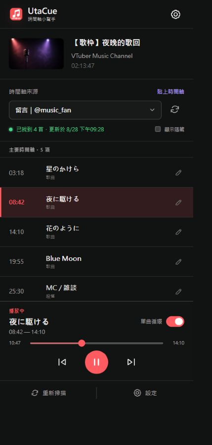
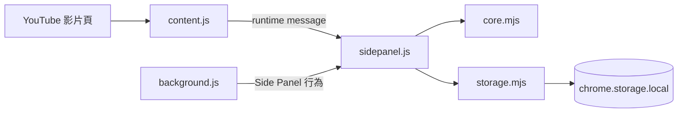

# UtaCue

UtaCue 是一個 Chrome Manifest V3 Side Panel 擴充功能，將 YouTube 影片的歌枠時間戳整理成可瀏覽、可編輯、可跳轉與可單曲循環的 Setlist。

它不需要 YouTube API、後端或登入。時間軸來源可以是目前影片的說明欄、已載入的留言，或使用者手動貼上的文字。

## 畫面預覽

<p align="center">
  
</p>

## 功能

- 掃描目前 YouTube 影片的說明欄與頁面上已載入的留言。
- 解析 `m:ss`、`mm:ss` 與 `h:mm:ss` 時間戳；無效時間戳會被忽略。
- 時間戳倒退時自動分成附加時間軸，並可選擇要顯示的來源或將附加區塊設為主要時間軸。
- 點擊項目即可跳轉並播放；歌曲支援循環播放至下一首歌曲／段落或影片結束。
- 以「歌曲」、「段落」、「註記」或「隱藏」標記項目，並可修改標題、開始時間與自訂結束時間。
- 重新掃描時顯示新增、變更、移除數量，並保留既有的人工修改。
- 依 YouTube `videoId` 將歌單儲存在 `chrome.storage.local`。
- 從設定匯出目前影片或全部歌單的 JSON，也可以匯入 JSON 備份。

## 技術堆疊

- Chrome Extension Manifest V3
- Chrome Side Panel、Content Script、Service Worker
- 原生 JavaScript ES Modules 與瀏覽器 API
- Node.js 內建 `node:test` 測試執行器
- 執行時沒有第三方 npm 相依套件

## 需求

- Chrome 114 或更新版本（由 `manifest.json` 的 `minimum_chrome_version` 指定）。
- 若要執行測試，需要可使用 `node:test` 的 Node.js 環境。

## 安裝與載入

這是未封裝的 Chrome 擴充功能，目前沒有 npm 安裝步驟：

1. 開啟 `chrome://extensions`。
2. 開啟右上角的「開發人員模式」。
3. 點擊「載入未封裝項目」，選取本專案資料夾。
4. 開啟任一 YouTube 影片，點擊工具列上的 UtaCue 圖示以開啟 Side Panel。

如果擴充功能是在 YouTube 分頁已開啟後才載入，請先重新整理該 YouTube 影片頁，讓 `content.js` 注入生效。

## 使用方式

1. 在 YouTube 影片頁開啟 UtaCue。
2. 點擊「掃描目前頁面」，讀取說明欄與目前已載入的留言。
3. 如果找不到時間戳，先在 YouTube 留言區往下捲動以載入更多留言，再重新掃描；也可以使用「貼上時間軸」。
4. 從「時間軸來源」選擇說明欄、留言作者或手動貼上的來源。
5. 點擊時間軸項目即可跳轉播放。選取歌曲時，下方會顯示播放控制、進度與「單曲循環」開關。
6. 點擊項目右側的編輯按鈕，可修改標題、時間與項目類型。
7. 在「設定」中匯入／匯出 JSON，或清除目前影片與全部本機歌單。

### 時間軸與循環規則

- 每一行必須包含有效時間戳與標題，例如 `04:05 歌曲名稱`。
- 當後續時間戳比前一個時間戳更早，解析器會建立新的附加區塊。
- 歌曲的自動結束時間依序取：自訂結束時間、下一個歌曲／段落的開始時間、影片長度。
- 「註記」與「隱藏」不會成為歌曲的自動循環界線；「段落」會成為界線。
- 沒有有限影片長度的直播無法啟用單曲循環。

## 開發與測試

```powershell
npm test
```

測試使用 Node.js 內建測試工具，不需要額外測試框架。測試涵蓋時間戳解析、區塊選擇、人工修改合併、資料驗證、YouTube SPA 換片情境、Side Panel 結構與 Manifest 圖示設定。

## Scripts

| 指令 | 說明 |
| --- | --- |
| `npm test` | 執行全部 Node.js 測試 |

## 專案結構

```text
.
├── manifest.json          # Chrome Manifest V3、權限與腳本註冊
├── background.js          # 設定點擊擴充功能圖示時開啟 Side Panel
├── content.js             # 讀取 YouTube 頁面、控制播放器與執行循環
├── sidepanel.html         # Side Panel UI 與對話框結構
├── sidepanel.css          # Side Panel 樣式與響應式版面
├── sidepanel.js           # UI 狀態、互動、掃描、編輯與備份流程
├── core.mjs               # 時間戳解析、歌單建立、合併與驗證
├── storage.mjs            # chrome.storage.local 讀寫與備份操作
├── fallback-thumbnail.png # 無法取得影片縮圖時使用的預設圖片
├── utacue-icon.png        # 擴充功能圖示
├── screenshots/
│   └── utacue-sidepanel.jpg # README 使用的介面截圖
├── package.json           # 專案名稱與測試指令
├── core.test.mjs          # 核心資料與時間軸邏輯測試
├── content.test.mjs       # YouTube SPA 換片與頁面情境測試
├── sidepanel.test.mjs     # Side Panel 結構測試
└── manifest.test.mjs      # Manifest 與圖示設定測試
```

## 架構



- `content.js` 在 YouTube `watch` 頁面收集影片資訊、說明欄與已載入留言，也負責接收跳轉、播放與循環指令。
- `sidepanel.js` 管理畫面狀態，將來源交給 `core.mjs` 解析，並把資料交給 `storage.mjs` 儲存。
- `background.js` 在安裝與啟動時設定擴充功能圖示的 Side Panel 行為。

## 資料與隱私

UtaCue 不呼叫 YouTube Data API，也沒有後端服務。掃描到的文字、人工修改、歌單與 JSON 備份只會保存在瀏覽器本機，不會由本專案傳送到外部服務。

## 授權

Copyright (c) 2026 Llamadayo

本專案中的原始碼以 MIT License 授權，完整條款請參閱 [LICENSE](LICENSE)。

本專案不擁有的第三方服務、商標、網站內容、縮圖或其他素材，仍受其各自的條款與授權規範約束。

## 疑難排解

- **Side Panel 顯示無法連線或 YouTube 頁面沒有回應**：確認目前分頁是 `https://www.youtube.com/watch...` 影片頁，並重新整理後再開啟 Side Panel。
- **掃描不到留言**：掃描只會讀取目前已載入到 DOM 的留言；請先捲動留言區，再重新掃描。
- **縮圖載入失敗**：介面會改用 `fallback-thumbnail.png`。
- **直播無法循環**：直播沒有可用的有限影片長度，因此不能計算歌曲的自動結束時間。
- **匯入資料覆蓋同一部影片**：匯入前會要求確認；相同 `videoId` 的既有資料會由匯入資料取代。
